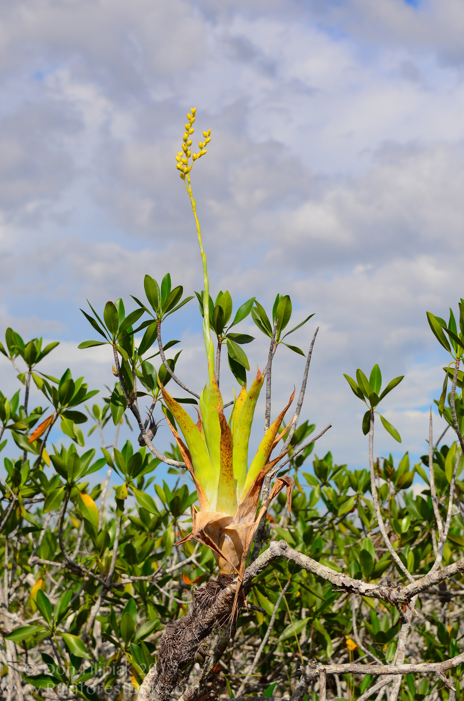
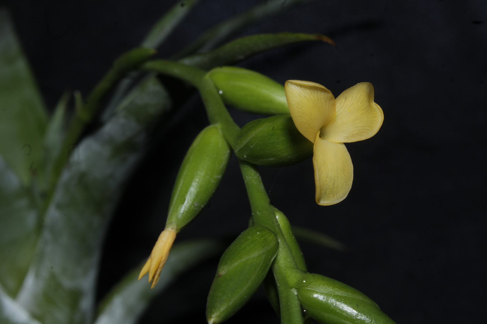
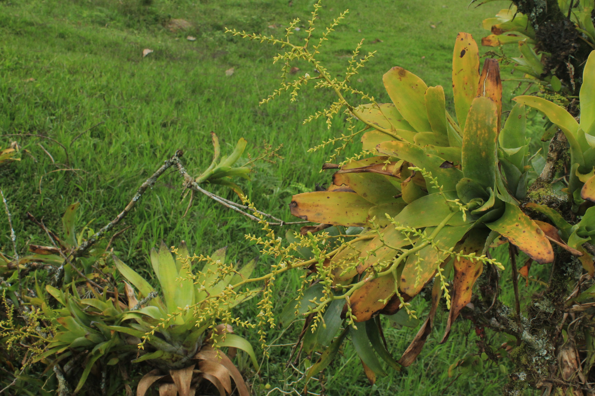
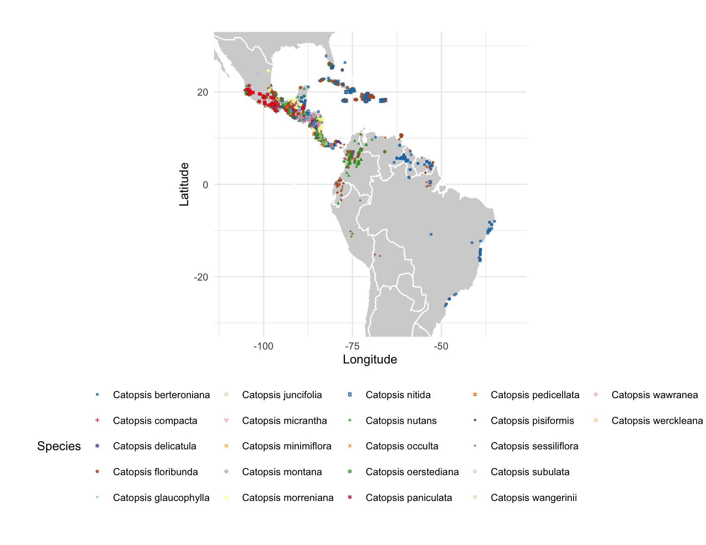
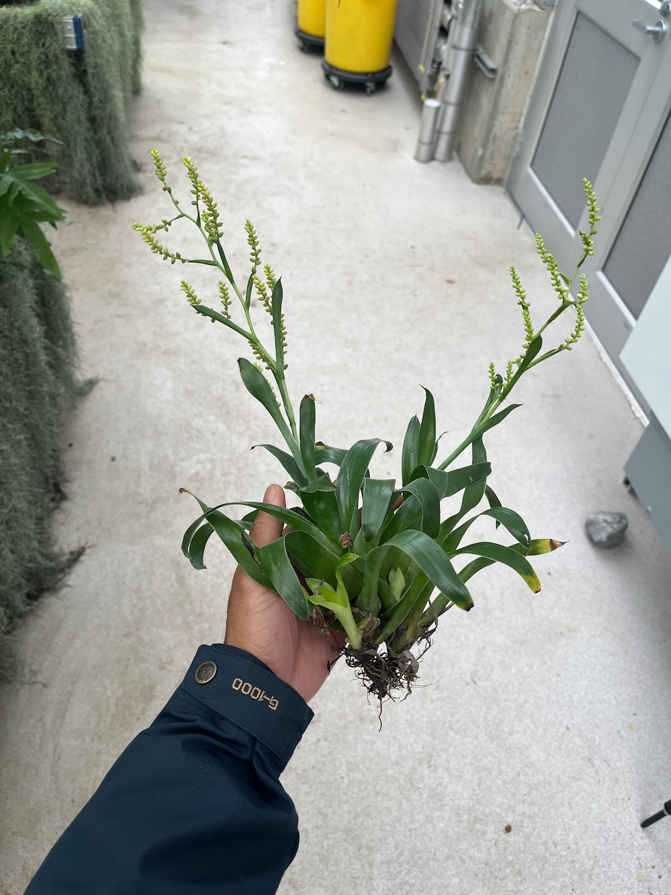
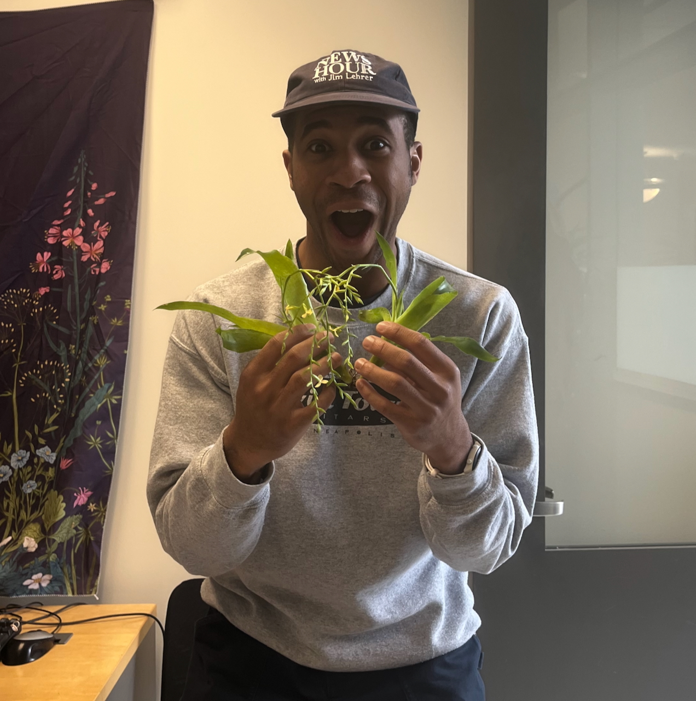

<i>Catopsis</i> Griseb. is an epiphytic genus in the subfamily Tillandsioideae. The center of diversity for the genus is Mexico, albeit, the genus can be found in the Caribbean, Central America, and the Brazilian shield of South America. <i>Catopsis</i> is one of the few bromeliad lineages that have dioecious species; only noted elsewhere in the family in <i>Hechtia</i> Klotzsch (Hechtioideae), the monotypic <i>Androlepis skinneri</i> (K.Koch) Brongn. ex Houllet (Bromelioideae) and <i>Aechmea mariae-reginae</i> H.Wendl. (Bromelioideae). Interestingly, the center for diversity for <i>Hechtia</i> is also in Mexico, and the two Bromelioideae species are found in Central America (Benzing, 2000). Little is known, however, as dioecious bromeliads have been mostly neglected in studies of genetic diversity and reproductive biology, other than the few cited studies (Ramírez-Morillo et al., 2005, Cascante-Marín et al., 2020).

    

        
    

    

        
    

    

        
    

    Left <i>Catopsis berteroniana</i> (Schult. & Schult.f.) Mez (c) Don Filipiak. <i>Catopsis nutans</i> (Swartz) Grisebach (c) Joseph S. Vega C. <i>Catopsis sessiliflora</i> (Ruiz & Pavón) Mez (c) Apipa

    

        
    

    _Catopsis_ distribution from cleaned GBIF records accessed June 2024

    

        
    

    

        
    

    You can find <i>Catopsis morreniana</i> and <i>Catopsis nutans</i> in the [Liberty Hyde Bailey Conservatory](https://conservatory.cals.cornell.edu/).

